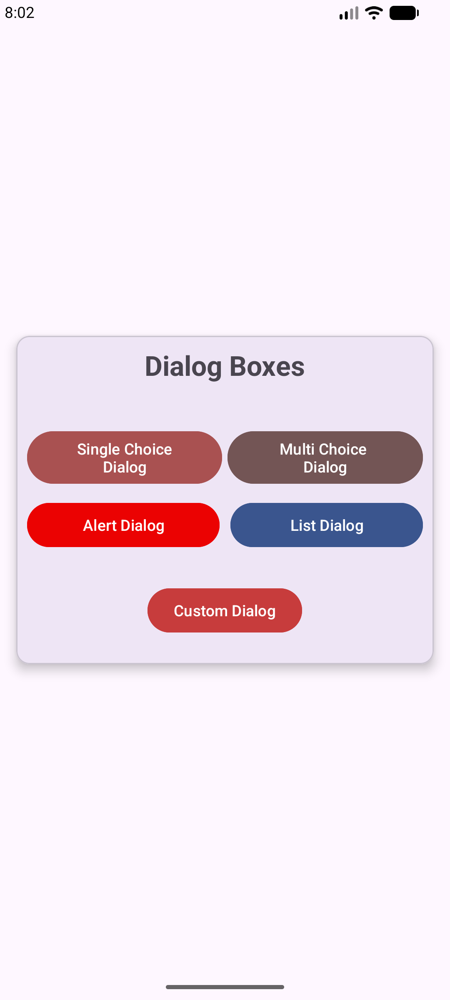
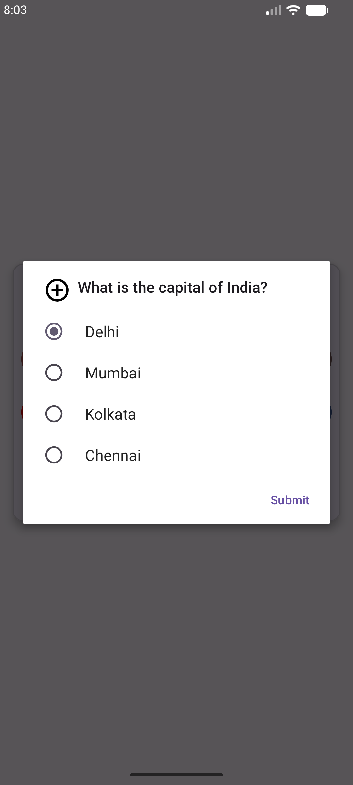
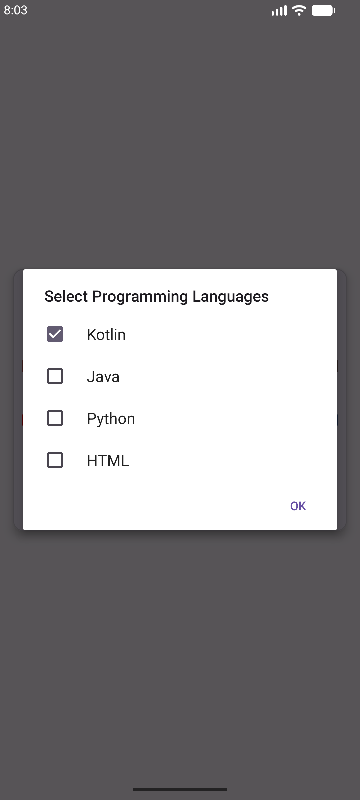
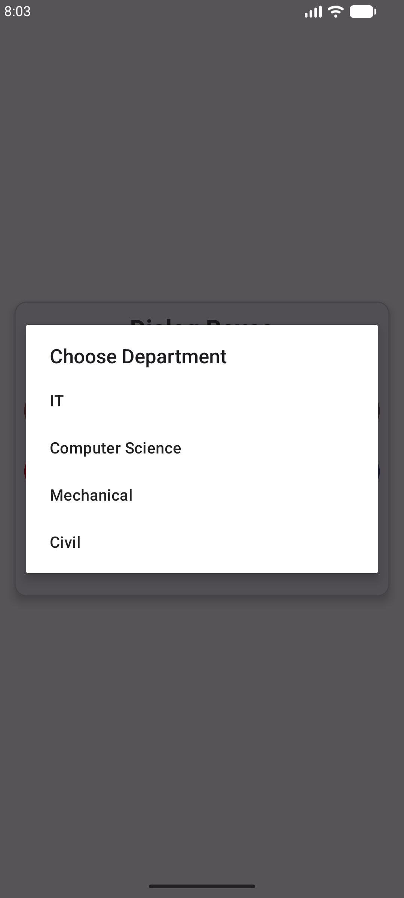
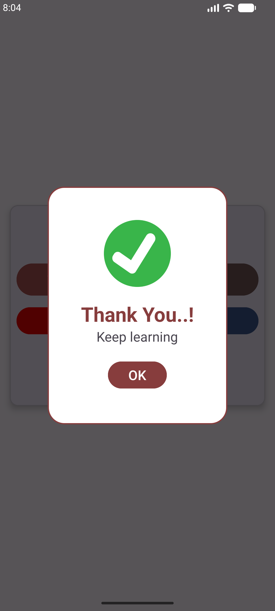

<<<<<<< HEAD
# Android Dialog Boxes

This project demonstrates different types of Dialog Boxes in Android using Kotlin.

## Topics Covered

- Alert Dialog
- Single Choice Dialog
- Multiple Choice Dialog
- Custom Dialog
- Toast messages
- Button click handling

## Technologies Used

- Kotlin
- Android Studio
- XML
- Material Design

## Screenshots

### Dialog Boxes

### Alert Dialog

### Single Choice Dialog

### Multiple Choice Dialog

### List Dialog

### Custom Dialog

